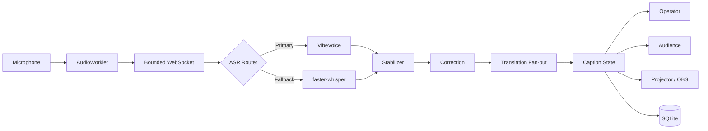

<h1 align="center">LangTextFlow</h1>

<p align="center">
  <strong>말하면 자막이 되고, 필요한 언어로 바로 전달됩니다.</strong><br>
  Local-first, open-source realtime multilingual captions for live events.
</p>

<p align="center">
  <a href="https://github.com/JDeun/LangTextFlow/actions/workflows/ci.yml"></a>
  <a href="https://github.com/JDeun/LangTextFlow/actions/workflows/codeql.yml"></a>
  <a href="LICENSE"></a>
</p>

LangTextFlow는 **실시간 음성을 자막으로 만들고, AI로 안정화·교정·번역해 청중의 휴대폰·프로젝터·OBS에 전달하는 오픈소스 앱**입니다.

교회/선교 집회에서 시작했지만 국제 컨퍼런스, 강의, 세미나, 사내 행사와 라이브 스트리밍처럼 **한 사람이 말하고 여러 사람이 각자의 언어로 읽어야 하는 상황**을 대상으로 설계합니다.

> [!IMPORTANT]
> **현재 상태: pre-field alpha.** 핵심 앱, desktop shell, 자동 설치/복구 경로, 보안·접근성·패키징 자동 검증은 구현되어 있습니다. 실제 공개 production release에는 Windows/macOS signing/notarization과 실제 장비·현장 음원 acceptance가 추가로 필요합니다.

## 무엇을 할 수 있나요?

| | 기능 | 설명 |
|---|---|---|
| 🎙️ | **실시간 자막** | 낮은 지연의 자막을 먼저 보여주고 점진적으로 안정화합니다. |
| 🌐 | **다국어 번역** | 하나의 원문을 여러 target language로 동시에 번역합니다. |
| 📱 | **청중 QR 접속** | 같은 네트워크의 청중이 읽기 전용 자막 화면에 접속합니다. |
| 🖥️ | **Projector / OBS** | 행사장 스크린과 라이브 스트리밍용 자막을 제공합니다. |
| 📚 | **전문 용어·자료 반영** | Hotword, Glossary, PDF/DOCX/TXT/Markdown 자료를 문맥으로 사용합니다. |
| 💾 | **기록과 내보내기** | 세션을 로컬에 기록하고 SRT, WebVTT, TXT, JSON으로 내보냅니다. |
| 🏠 | **Local-first** | VibeVoice/faster-whisper/Ollama 등 로컬 구성을 지원합니다. |

## 5단계면 시작됩니다

```text
① 마이크 선택
      ↓
② 말하는 언어 선택
      ↓
③ 번역할 언어 선택
      ↓
④ 세션 시작
      ↓
⑤ QR / Projector / OBS로 공유
```

첫 실행의 **Onboarding**과 **Preflight**가 마이크, 음성 인식, 번역 엔진과 로컬 모델 준비 상태를 확인합니다. 일반적인 사용에서는 엔진 내부 설정을 직접 만질 필요가 없도록 설계합니다.

처음 사용하는 분은 **[사용자 가이드](docs/USER_GUIDE.md)**부터 읽으십시오.

## 어디에 사용할 수 있나요?

- **교회 / 선교 집회** — 외국인 참석자에게 실시간 번역 자막
- **국제 컨퍼런스 / 세미나** — 발표를 여러 언어로 동시에 전달
- **강의 / 교육** — 수업과 강연의 실시간 접근성·다국어 지원
- **기업 행사 / 미팅** — 전문 용어 glossary와 자료 context 활용
- **라이브 스트리밍** — Projector/OBS surface를 이용한 영상 자막

## 어떻게 동작하나요?

```text
말하기
  ↓
실시간 음성 인식
  ↓
자막 안정화 / 교정
  ↓
여러 언어로 번역
  ↓
휴대폰 / 프로젝터 / OBS
```

예를 들어 발표자가 한국어로 말하고 영어와 일본어 청중이 함께 듣는다면 하나의 한국어 자막에서 English와 日本語 번역을 동시에 만들 수 있습니다. 청중은 Operator 설정에 접근하지 않고 자신의 자막 화면만 봅니다.

## 정확도를 높이고 싶다면

**Hotwords**에는 사람 이름·회사명·제품명처럼 인식이 틀리기 쉬운 단어를, **Glossary**에는 전문 용어와 원하는 번역을 등록합니다. 발표 자료가 있다면 TXT, Markdown, PDF, DOCX를 reference context로 추가할 수 있습니다.

## 개인정보와 로컬 실행

LangTextFlow는 **local-first**를 기본 방향으로 합니다. Operator 제어와 오디오 입력은 로컬 PC 경계에서 보호하고, LAN에는 join-code 기반의 읽기 전용 Audience 경로만 노출합니다. 세션 기록은 기본적으로 로컬 SQLite에 저장하며, 외부 OpenAI-compatible provider는 사용자가 명시적으로 선택할 때만 사용합니다.

## 설치와 실행

### 일반 사용자

Windows/macOS desktop bundle과 release workflow가 구현되어 있습니다. 현재 공개 production release 전 단계이므로 **서명된 공식 installer가 배포되기 전에는 source/development build가 기준**입니다.

공개 installer가 준비되면 이 섹션을 다운로드 중심 설치 안내로 전환합니다. 현재 문제 해결은 [Troubleshooting](docs/TROUBLESHOOTING.md)을 참조하십시오.

### 개발자 / Source 실행

<details>
<summary><strong>Backend</strong></summary>

Python 3.11+:

```bash
python -m venv .venv
source .venv/bin/activate  # Windows: .venv\Scripts\activate
pip install -e '.[dev,whisper]'
uvicorn langtextflow.main:app --app-dir apps/server --reload --host 0.0.0.0 --port 8000
```

</details>

<details>
<summary><strong>Frontend</strong></summary>

Node.js 22 권장:

```bash
cd apps/web
npm ci
npm run dev
```

</details>

<details>
<summary><strong>지원 provider</strong></summary>

- **Auto** — VibeVoice 우선, failure 시 faster-whisper fallback
- **VibeVoice Streaming** — pinned local sidecar/runtime/model provisioning
- **faster-whisper** — local micro-batch fallback/runtime
- **Demo** — 실제 ASR 모델 없이 caption lifecycle 확인
- **Ollama** — local translation, install/health/managed-start 복구
- **OpenAI-compatible** — LM Studio / vLLM / compatible endpoint

</details>

> [!CAUTION]
> Operator 화면을 LAN에 직접 공개하지 마십시오. 세션 제어·setup·audio input은 loopback client 경계에 두고 청중은 Audience 경로를 사용해야 합니다.

## 현재 구현 상태

코드로 구현 가능한 pre-field 영역은 광범위하게 자동화되어 있습니다.

- Tauri 2 desktop shell + PyInstaller backend sidecar
- Windows/macOS bundle workflow와 signed installer/updater release plumbing
- VibeVoice/faster-whisper/Ollama runtime·model setup/repair/cache
- ASR primary/fallback + one-way failover
- correction + multi-target translation fan-out
- SQLite history/export
- Operator/Audience/Projector/OBS
- en/ko/ja UI localization
- axe 기반 WCAG 자동 접근성 검사
- synthetic lifecycle/load/soak regression
- adversarial/security/repository/CSS/i18n hygiene gates
- Ruff/pytest/coverage/pip-audit/npm audit/Bandit/CodeQL/SBOM

### 실제 환경이 있어야 완료할 수 있는 것

1. 실제 한국어·영어 현장 음원의 ASR/번역/교정 품질 baseline
2. 대상 Windows/macOS 장비의 30/60/90분 실제 soak와 latency/memory acceptance
3. 행사장 마이크·오디오 인터페이스·LAN 환경 검증
4. 실제 Windows code-signing certificate와 Apple signing/notarization
5. 사람을 통한 최종 usability/accessibility acceptance

자동 benchmark **harness가 있다는 것**과 실제 field acceptance가 끝났다는 것은 구분합니다.

## 개발자를 위한 기술 정보

<details>
<summary><strong>Realtime pipeline</strong></summary>



Caption lifecycle: `PARTIAL → STABLE → CORRECTED → TRANSLATED → COMMITTED`

</details>

<details>
<summary><strong>Repository structure</strong></summary>

```text
LangTextFlow/
├─ apps/
│  ├─ desktop/             # Tauri shell + backend sidecar supervision
│  ├─ server/              # FastAPI realtime runtime
│  └─ web/                 # React operator/audience/projector/OBS
├─ benchmarks/
├─ docs/
├─ scripts/
└─ .github/workflows/
```

</details>

## 품질과 보안

CI에는 backend boundary/property/adversarial regression, Browser E2E, axe accessibility, Windows/macOS smoke, dependency audit, repository/CSS/i18n hygiene와 CodeQL이 포함됩니다.

- [Security Model](docs/SECURITY_MODEL.md)
- [Adversarial Validation](docs/ADVERSARIAL_VALIDATION.md)
- [Benchmark](docs/BENCHMARK.md)
- [Release Checklist](docs/RELEASE_CHECKLIST.md)

## 문서

### 처음 사용하는 분

- **[사용자 가이드](docs/USER_GUIDE.md)** — 처음 실행부터 세션 종료까지
- **[문제 해결](docs/TROUBLESHOOTING.md)** — 마이크/자막/번역/청중 접속 문제
- **[FAQ](docs/FAQ.md)** — 자주 묻는 질문

### 운영·설정

- [Onboarding](docs/ONBOARDING.md)
- [Preflight](docs/PREFLIGHT.md)
- [Display Settings](docs/DISPLAY_SETTINGS.md)
- [Model Setup](docs/MODEL_SETUP.md)

### 개발·설계

- [전체 문서 인덱스](docs/README.md)
- [Architecture](docs/ARCHITECTURE.md)
- [UI/UX Design System](docs/DESIGN_SYSTEM.md)
- [Failover](docs/FAILOVER.md)
- [Observability](docs/OBSERVABILITY.md)
- [Roadmap](docs/ROADMAP.md)

## 라이선스

LangTextFlow 자체 코드는 **Apache License 2.0**입니다. 외부 model/runtime/dataset에는 각각의 라이선스가 적용됩니다.

---

<p align="center">
  <strong>말하는 사람은 그대로 말하고, 듣는 사람은 자신의 언어로 읽을 수 있게.</strong>
</p>
