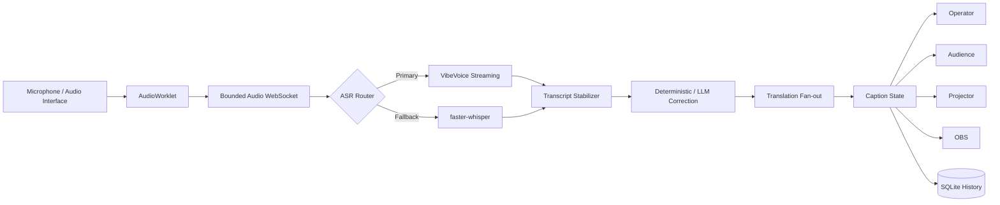

<h1 align="center">LangTextFlow</h1>

<p align="center">
  <strong>말하는 순간 자막이 되고, 안정화되고, 필요한 언어로 전달됩니다.</strong><br>
  Local-first realtime multilingual captions for talks, worship services, conferences, and classrooms.
</p>

<p align="center">
  <a href="https://github.com/JDeun/LangTextFlow/actions/workflows/ci.yml"></a>
  <a href="https://github.com/JDeun/LangTextFlow/actions/workflows/codeql.yml"></a>
  <a href="LICENSE"></a>
  
  
</p>

> [!IMPORTANT]
> **현재 배포 상태:** 핵심 실시간 자막 파이프라인과 웹 UI, 로컬 provider 연동, 보안/복구 경계, benchmark harness는 구현되어 있습니다. 다만 일반 사용자를 위한 signed Windows/macOS 설치 프로그램과 실제 대상 장비의 장시간 field acceptance는 아직 완료 전입니다. 현재는 **source-first alpha**로 간주하십시오.

> [!NOTE]
> LangTextFlow는 가능한 처리를 로컬에서 수행합니다. Operator 제어 API와 오디오 WebSocket은 loopback-only이며, LAN에는 join code 기반 audience read-only 경로만 노출합니다. 클라우드/OpenAI-compatible provider는 명시적으로 선택할 때만 사용합니다.

LangTextFlow는 음성을 단순히 한 번 전사하는 도구가 아니라, **낮은 지연의 임시 자막을 먼저 표시하고 같은 segment를 안정화·교정·번역·commit하는 실시간 자막 플랫폼**을 목표로 합니다. 첫 vertical preset은 교회/선교 집회이지만, General / Conference / Lecture preset을 포함해 일반 강연과 교육 환경에서도 사용할 수 있도록 설계합니다.

## 한눈에 보기

| 영역 | 현재 경로 | 핵심 특성 |
|---|---|---|
| Audio | Browser AudioWorklet → `/ws/audio` | mono float32 PCM, bounded queue/backpressure |
| Primary ASR | Microsoft VibeVoice streaming sidecar | context/hotword 전달, streaming transcript |
| Fallback ASR | faster-whisper | local micro-batch, prompt/hotword/language 지원 |
| Failover | `Auto`: VibeVoice → faster-whisper | replay ring buffer, timestamp rebase, duplicate suppression |
| Correction | deterministic + optional constrained LLM | provenance 보존, unsafe change fallback |
| Translation | Ollama / OpenAI-compatible | 다중 target language fan-out, degraded mode |
| Context | hotwords / glossary / TXT·MD·PDF·DOCX | bounded extraction, session snapshot |
| Delivery | Operator / Audience / Projector / OBS | WebSocket patch, QR/LAN join |
| Persistence | SQLite | session history, latest-version guard, export |
| Export | SRT / WebVTT / TXT / JSON | target language 선택 + source fallback |

## 처리 구조



자막 lifecycle은 다음 상태를 중심으로 동작합니다.

```text
PARTIAL → STABLE → CORRECTED → TRANSLATED → COMMITTED
```

각 segment는 `segment_id + version`으로 갱신되므로 낮은 지연의 draft를 먼저 보여주면서 같은 자막을 점진적으로 안정화할 수 있습니다.

## 핵심 기능

### 실시간 ASR과 장애 복구

- VibeVoice streaming sidecar와 faster-whisper local adapter
- `Auto` 시작 시 VibeVoice 우선, 시작 실패 시 faster-whisper fallback
- 세션 도중 VibeVoice fatal failure 시 faster-whisper로 one-way handoff
- 최근 PCM replay ring buffer와 provider-local timestamp의 session timeline rebase
- replay 구간 timestamp/text overlap duplicate suppression
- ASR queue/backpressure, provider health, failover count/reason telemetry
- RMS dBFS 기반 voice activity monitoring — audio를 삭제하는 gating이 아니라 관측용

의도적으로 자동 failback은 하지 않습니다. 실패한 provider가 반복 복귀하면 duplicate caption과 provider oscillation을 만들 수 있기 때문입니다. 자세한 내용은 [Failover 설계](docs/FAILOVER.md)를 참조하십시오.

### 교정·번역·도메인 context

- Unicode/whitespace deterministic normalization
- Church preset의 보수적 STT alias correction
- constrained LLM correction + provenance
- Ollama local translation 및 OpenAI-compatible `/v1` provider
- 하나의 source에서 복수 target language로 fan-out
- 번역 provider 장애 시에도 원문 자막 지속
- persistent glossary: alias / 번역 / category / boost / preset scope
- JSON/CSV glossary import/export
- TXT / Markdown / PDF / DOCX reference document extraction
- session 시작 시 glossary/context를 immutable snapshot으로 고정해 ASR·교정·번역에 공유

### 운영자·청중 UX

- first-run onboarding wizard
- system preflight: OS/CPU/RAM/disk/NVIDIA/Apple Silicon/microphone/provider readiness
- 선택한 ASR/번역 구성 기준 blocking preflight
- Ollama model pull/status/cancel
- faster-whisper model cache prefetch
- 준비된 VibeVoice sidecar start/status/stop lifecycle
- source + 복수 target language 선택
- Audience / Projector / OBS별 표시 언어 선택
- Display Profile: font, size, max lines, hold time, source 병기, 정렬
- QR 기반 LAN audience join

### 세션 기록과 export

SQLite를 세션 기록의 canonical store로 사용합니다. 라이브 WebSocket 송출과 persistence는 분리되어 있어 DB 쓰기 실패가 실시간 원문 자막 자체를 멈추지 않도록 설계합니다.

- 최근 session history
- 제목/메모 사후 편집
- original Session Context 보존
- latest segment version upsert guard
- SRT / WebVTT / TXT / JSON export
- target language export와 source fallback

## 보안·안정화 원칙

LangTextFlow는 happy-path 테스트 통과만으로 release-ready라고 간주하지 않습니다.

현재 자동 gate는 다음을 포함합니다.

- malformed/oversized float32 PCM, NaN/Inf 및 비정상 amplitude 방어
- VibeVoice inbound message/transcript size 제한
- slow/broken WebSocket client 격리, send timeout, connection cap
- server-push-only caption socket과 strict audio control message
- browser WebSocket Origin 검증
- audience join-code rate limiting / brute-force hardening
- DOCX ZIP bomb, oversized archive/XML, DTD/entity, unsafe XML parser 방어
- bounded Pydantic schema cardinality/length
- LLM system policy와 transcript/reference/glossary 데이터 경계 분리
- model response size 제한
- SQLite disk-full failure injection 및 degraded-mode 회귀 검증
- repository hygiene scan
- `pip check`, `pip-audit`, `npm audit`, Bandit, Ruff, coverage gate
- CodeQL Python + JavaScript/TypeScript
- Dependabot

상세 공격 표면과 trust boundary는 [Security Model](docs/SECURITY_MODEL.md), 공개 취약점 제보 정책은 [SECURITY.md](SECURITY.md), release acceptance는 [Release Checklist](docs/RELEASE_CHECKLIST.md)를 참조하십시오.

## Benchmark와 품질 검증

ASR 단일 성능뿐 아니라 **전체 realtime path가 실제 시간보다 뒤처지는지**, provider failure에서 자막이 얼마나 회복되는지, correction이 원문을 해치지 않는지를 별도로 측정합니다.

- ASR micro-benchmark: RTF, realtime lag, CER/WER, queue, RSS, failover/duplicate 후보
- full runtime benchmark: ASR → correction → translation → persistence
- translation benchmark: success, latency, terminology metrics
- correction quality gate: harmful/wrong/missed change, critical-token/numeric safety
- `realtime` / `max` pacing
- 동일 WAV 반복을 통한 30/60/90분 soak 입력 harness

> [!WARNING]
> Benchmark **harness 구현**과 실제 release acceptance 결과는 구분합니다. 실제 한국어·영어 집회 음원과 대상 Windows/macOS 장비에서의 30/60/90분 soak 및 field baseline은 아직 수행해야 합니다.

자세한 protocol은 [Benchmark](docs/BENCHMARK.md), [Translation Benchmark](docs/TRANSLATION_BENCHMARK.md), [Correction Quality](docs/CORRECTION_QUALITY.md)를 참조하십시오.

## 시작하기

### Backend

Python 3.11+ 환경에서 개발 의존성을 설치합니다.

```bash
python -m venv .venv
source .venv/bin/activate  # Windows: .venv\Scripts\activate
pip install -e '.[dev]'
```

`Auto` / `faster-whisper`까지 실행하려면:

```bash
pip install -e '.[dev,whisper]'
```

서버 실행:

```bash
uvicorn langtextflow.main:app --app-dir apps/server --reload --host 0.0.0.0 --port 8000
```

### Frontend

Node.js 22 계열을 권장합니다.

```bash
cd apps/web
npm ci
npm run dev
```

운영자 화면은 로컬 PC에서 `http://localhost:5173`으로 엽니다.

> [!CAUTION]
> Operator 화면을 LAN 주소로 직접 운영하지 마십시오. 세션 제어, 용어집, history, telemetry, setup, audio input은 loopback client만 허용하는 것이 보안 계약입니다. LAN에는 audience read-only 경로만 노출합니다.

### Provider 준비

- **Auto** — VibeVoice를 우선 사용하고 failure 시 faster-whisper로 전환
- **VibeVoice Streaming** — 로컬 VibeVoice sidecar
- **faster-whisper** — 로컬 micro-batch adapter
- **Demo** — 실제 ASR 모델 없이 caption state pipeline 확인
- **Ollama translation** — 기본 로컬 번역 모델 설정은 `translategemma:4b`
- **OpenAI-compatible** — LM Studio / vLLM / compatible cloud endpoint

세부 설치/설정은 [VibeVoice](docs/VIBEVOICE.md), [faster-whisper](docs/FASTER_WHISPER.md), [Model Setup](docs/MODEL_SETUP.md), [Preflight](docs/PREFLIGHT.md)를 참조하십시오.

로컬 사용자 DB 기본 경로는 `data/langtextflow.db`이며 Git에 포함되지 않습니다.

## 프로젝트 구조

```text
LangTextFlow/
├─ apps/
│  ├─ server/               # FastAPI, realtime runtime, ASR/translation, SQLite
│  └─ web/                  # React/Vite operator + audience/projector/OBS UI
├─ benchmarks/              # correction/translation policy & sample fixtures
├─ docs/                    # architecture, provider, security, benchmark docs
├─ scripts/                 # repository/security policy gates
├─ .github/workflows/       # CI + CodeQL
├─ SECURITY.md
└─ LICENSE
```

## 문서

전체 문서 인덱스는 **[docs/README.md](docs/README.md)**에서 목적별로 정리합니다.

빠르게 볼 문서:

- [Architecture](docs/ARCHITECTURE.md)
- [Roadmap](docs/ROADMAP.md)
- [Onboarding](docs/ONBOARDING.md)
- [Preflight](docs/PREFLIGHT.md)
- [Failover](docs/FAILOVER.md)
- [Observability](docs/OBSERVABILITY.md)
- [Security Model](docs/SECURITY_MODEL.md)
- [Release Checklist](docs/RELEASE_CHECKLIST.md)

## 현재 남은 핵심 과제

코드가 구현됐다는 것과 일반 사용자용 상용 배포가 완료됐다는 것은 구분합니다. 현재 큰 미완료 축은 다음과 같습니다.

1. 실제 한국어·영어 집회 음원에서 ASR/failover/translation/correction baseline 확정
2. 대상 장비에서 30/60/90분 soak 및 memory/latency acceptance
3. VibeVoice runtime/model, faster-whisper runtime, Ollama app까지 포함하는 app-managed installation lifecycle
4. Tauri 또는 동등한 desktop shell과 signed Windows/macOS installer
5. crash diagnostics, update channel, offline-first model cache
6. desktop/e2e/load/accessibility/i18n acceptance

세부 진행 상태는 [Roadmap](docs/ROADMAP.md)에 체크박스로 유지합니다.

## 라이선스

LangTextFlow 자체 코드는 **Apache License 2.0**으로 배포합니다. 자세한 내용은 [LICENSE](LICENSE)를 참조하십시오.

외부 모델·runtime·데이터셋의 라이선스는 각각 별도로 적용됩니다. CaptionFlow 등 GPL 프로젝트는 아키텍처 reference로만 사용하며, 해당 프로젝트의 코드를 LangTextFlow에 복사해 포함하는 것을 전제로 하지 않습니다.
